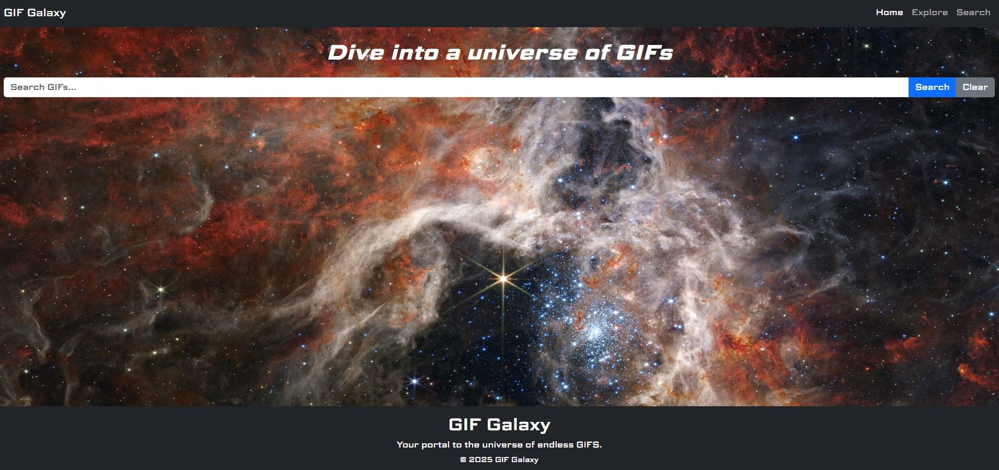
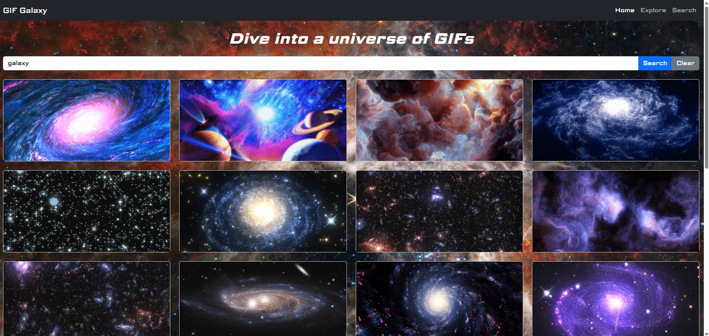

# Project-2-GIFGalaxy
**GIF Galaxy** is a responsive, JavaScript-powered web application that allows users to search for animated GIFs using the Giphy API. By entering any keyword, users can instantly generate a curated selection of GIFs that match their search term. The app dynamically renders each result in a clean, organized grid layout designed for easy browsing on both desktop and mobile devices.

GIF Galaxy emphasizes speed, simplicity, and usability. Its interface provides immediate visual feedback, clear error messages, and smooth content updates without page reloads. Whether users are searching for reactions, moods, or something fun, GIF Galaxy turns every query into a quick voyage through a personalized universe of animated results.
## How to Use
1. Type a keyword into the search bar and click **Search**.
2. Browse the GIF results displayed in the grid.
3. To remove results, click **Clear**.
4. If no results appear, try a different keyword or check your connection.
## Features
- **Giphy API Integration** - Fetches GIFs in real time.
- **Interactive Search System** - Search for any GIF theme.
- **Dynamic Content Rendering** - Animations appear at light speed.
- **Responsive Grid Layout** - GIFs orbit perfectly on any device.
- **Error Handling** - Shows messages when no GIFs are found or an error occurs.
## Technologies Used
- **HTML** – structure of the application  
- **CSS** – custom styling and layout  
- **Bootstrap v5.3.8** – responsive grid and UI components  
- **JavaScript** – interactive functionality  
- **Giphy API** – GIF search functionality  
- **JavaScript Promises** – handling asynchronous API requests
## User Stories
1. As a user, I want to search for GIFs by typing in keywords, so that I can quickly find animations that match what I'm looking for.
2. As a user, I want GIF results to load instantly and display in an organized, responsive grid, so that I can easily browse through many GIFs on any device.
3. As a user, I want to receive a clear message when my search returns no GIFs or when something goes wrong, so that I understand what happened and can try again.
## Wireframes
### Home Page - Desktop Version

### Search Result - Mobile Version

## Screenshots

## Ideas for Future Improvement
1. User can save favorite GIFs to revisit later using localStorage, creating a personalized collection.
2. User can explore preset categories like "Trending," "Reactions," or "Animals" to discover GIFs more easily.
3. User can scroll or click to load additional GIFs without leaving the page, making browsing more seamless.
## Developer: [Hazel Arevalo](https://linkedin.com/in/harevalo123)