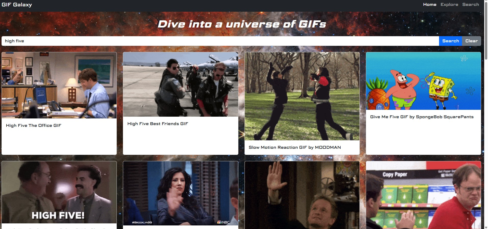
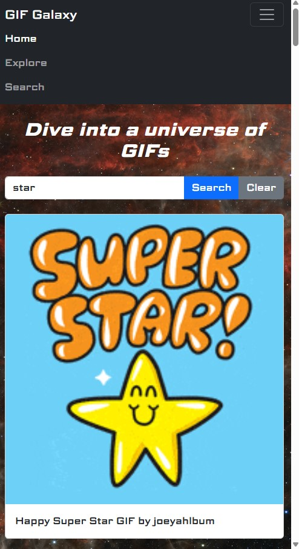

# Project-2-GIFGalaxy
## Developer: [Hazel Arevalo](https://linkedin.com/in/harevalo123)
**GIF Galaxy** is a web application that allows users to search and explore animated GIFs using the Giphy API. The platform features responsive design, dynamic rendering, and an intuitive interface to ensure fast and seamless browsing. Users can quickly discover GIFs across a wide range of categories, making GIF Galaxy a simple and efficient tool for finding animated content.
## How to Use
1. Type a keyword into the search bar and click **Search**.
2. Browse the GIF results displayed in the grid.
3. To remove results, click **Clear**.
4. If no results appear, try a different keyword or check your connection.
## Features
- **Giphy API Integration** - Fetches GIFs in real time.
- **Interactive Search System** - Search for any GIF theme.
- **Dynamic Content Rendering** - Animations appear at light speed.
- **Responsive Grid Layout** - GIFs orbit perfectly on any device.
- **Error Handling** - Shows messages when no GIFs are found or an error occurs.
## Technology Used
1. HTML
2. CSS
3. Bootstrap v5.3.8
4. JavaScript
## Screenshots

## Wireframes
### Home Page - Desktop Version

### Search Result - Mobile Version

## User Stories
1. As a user, I want to search for GIFs by typing in keywords, so that I can quickly find animations that match what I'm looking for.
2. As a user, I want GIF results to load instantly and display in an organized, responsive grid, so that I can easily browse through many GIFs on any device.
3. As a user, I want to receive a clear message when my search returns no GIFs or when something goes wrong, so that I understand what happened and can try again.
## Ideas for Future Improvement
1. User can save favorite GIFs to revisit later using localStorage, creating a personalized collection.
2. User can explore preset categories like "Trending," "Reactions," or "Animals" to discover GIFs more easily.
3. User can scroll or click to load additional GIFs without leaving the page, making browsing more seamless.